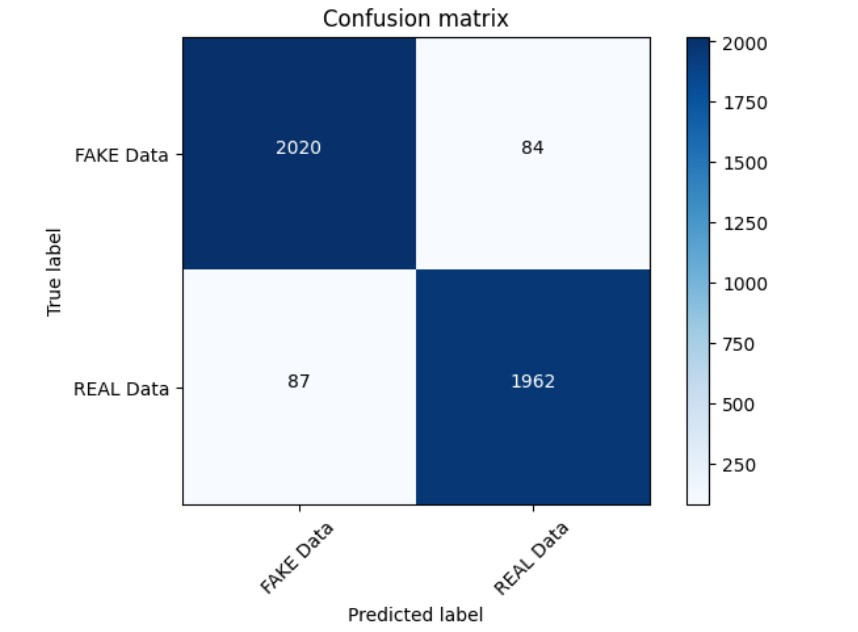

# Fake News Detection using Machine Learning

A Machine Learning and Natural Language Processing (NLP) based web application that classifies news articles as **Real** or **Fake** using **TF-IDF Vectorization** and a **Passive Aggressive Classifier**.

The trained machine learning model is integrated with a **Flask web application** to provide real-time predictions through a simple web interface.

---

## 📌 Table of Contents

- [Introduction](#-introduction)
- [Problem Statement](#-problem-statement)
- [Objectives](#-objectives)
- [Features](#-features)
- [Technology Stack](#-technology-stack)
- [Project Architecture](#-project-architecture)
- [Project Structure](#-project-structure)
- [Dataset](#-dataset)
- [Machine Learning Workflow](#-machine-learning-workflow)
- [Model](#-model)
- [Performance](#-performance)
- [Web Application](#-web-application)
- [Prerequisites](#-prerequisites)
- [Installation](#-installation)
- [Running the Application](#-running-the-application)
- [Example](#-example)
- [Visualizations](#-visualizations)
- [Future Improvements](#-future-improvements)
- [Applications](#-applications)
- [Learning Outcomes](#-learning-outcomes)
- [Author](#-author)

---

## 🚀 Introduction

Fake news and misinformation have become major challenges in the digital information ecosystem. This project uses Machine Learning and Natural Language Processing to classify news articles based on their textual content.

The system processes news text, extracts important textual features using **TF-IDF**, and uses a **Passive Aggressive Classifier** to predict whether the news is likely to be real or fake.

The trained model is deployed using a **Flask web application**, allowing users to enter news content and receive a prediction in real time.

> **Note:** The prediction is a machine-learning classification result and should not be considered definitive fact verification.

---

## 🎯 Problem Statement

The objective of this project is to develop a Machine Learning system capable of classifying news articles based on their textual characteristics.

The model learns patterns from labelled news data and uses these patterns to classify previously unseen news content.

### Input

The system accepts news information such as:

- Headline
- Author
- Article body

### Output

The system predicts one of the following classes:

- ✅ **REAL**
- ❌ **FAKE**

---

## 🎯 Objectives

The main objectives of this project are:

- Collect and preprocess a labelled news dataset.
- Perform Natural Language Processing on news text.
- Convert textual data into numerical features using TF-IDF.
- Train a Passive Aggressive Classifier.
- Evaluate the trained machine learning model.
- Save the trained model and TF-IDF vectorizer.
- Develop a Flask backend for real-time prediction.
- Create a simple web interface for users.
- Provide a user-friendly news classification workflow.

---

## ✨ Features

- 📰 Fake and real news classification
- 🤖 Machine Learning based prediction
- 🧠 Natural Language Processing
- 🔤 TF-IDF feature extraction
- ⚡ Passive Aggressive Classifier
- 🌐 Flask web application
- 📊 Model evaluation
- 📈 Confusion matrix visualization
- 💾 Serialized ML model
- 🔄 Real-time prediction
- 🖥️ Simple and user-friendly interface

---

## 🛠️ Technology Stack

### Programming Language

- Python

### Machine Learning

- Scikit-learn
- Passive Aggressive Classifier
- TF-IDF Vectorizer

### Natural Language Processing

- Text preprocessing
- Text cleaning
- TF-IDF feature extraction

### Backend

- Flask

### Frontend

- HTML
- CSS
- JavaScript

### Data Processing

- Pandas
- NumPy

### Development Tools

- Jupyter Notebook
- Git
- GitHub
- VS Code

---

## 🏗️ Project Architecture

The project follows the following workflow:

```text
News Dataset
     |
     v
Data Preprocessing
     |
     v
Text Processing
     |
     v
TF-IDF Vectorization
     |
     v
Passive Aggressive Classifier
     |
     v
Model Training
     |
     +------------------+
     |                  |
     v                  v
 model.pkl          vector.pkl
     |                  |
     +---------+--------+
               |
               v
        Flask Application
               |
               v
        Web User Interface
               |
               v
        REAL / FAKE Result
📂 Project Structure
Fake-News-Detection-using-Machine-Learning/
│
├── Images/
│   ├── BlockDiagram.jpg
│   ├── Processflow.jpg
│   └── ConfusionMatrix.jpg
│
├── dataset/
│   ├── train.csv
│   └── test.csv
│
├── static/
│   ├── css/
│   ├── js/
│   └── images/
│
├── templates/
│   ├── Landingpage.html
│   └── prediction page.html
│
├── Fake_News_Detector-PA.ipynb
├── app.py
├── model.pkl
├── vector.pkl
├── requirements.txt
└── README.md
📊 Dataset

The project uses a labelled news dataset containing real and fake news articles.

Training Dataset

The training dataset is stored in:

dataset/train.csv

It contains the following important attributes:

Column	Description
id	Unique identifier of the news article
title	Headline of the article
author	Author of the article
text	Main body of the article
label	Classification label
Label Encoding
Label	Meaning
0	Real / Reliable
1	Fake / Unreliable
Testing Dataset

The testing dataset is stored in:

dataset/test.csv

It contains news articles used for testing and prediction.

🔄 Machine Learning Workflow
1. Data Collection

The labelled news dataset is loaded using Pandas.

2. Data Preprocessing

The textual data is cleaned and prepared for Machine Learning.

The preprocessing stage includes handling missing values and preparing relevant news text for feature extraction.

3. Feature Extraction

The project uses TF-IDF Vectorization to convert text into numerical feature vectors.

Raw Text
   ↓
Text Preprocessing
   ↓
TF-IDF Vectorization
   ↓
Numerical Features
4. Model Training

The extracted features are provided to the Passive Aggressive Classifier.

5. Model Evaluation

The trained model is evaluated using classification metrics and a confusion matrix.

6. Model Serialization

The trained classifier is saved as:

model.pkl

The TF-IDF vectorizer is saved as:

vector.pkl
7. Flask Integration

The saved model and vectorizer are loaded into the Flask application.

8. Prediction

Users submit news content through the web interface and receive a predicted classification.

🤖 Model
Passive Aggressive Classifier

The project uses the Passive Aggressive Classifier, an online learning algorithm commonly used for text classification.

The classifier updates its parameters when a prediction is incorrect and remains relatively unchanged when predictions are correct.

TF-IDF Vectorizer

TF-IDF stands for Term Frequency-Inverse Document Frequency.

It converts textual data into numerical values based on the importance of words within the dataset.

The complete prediction pipeline is:

News Text
    ↓
Text Preprocessing
    ↓
TF-IDF Vectorizer
    ↓
Feature Vector
    ↓
Passive Aggressive Classifier
    ↓
Prediction
📈 Performance

The Passive Aggressive Classifier achieved approximately:

96% accuracy

on the validation data used during project development.

The project also includes a confusion matrix to analyse classification results.

The actual performance can vary depending on the dataset split, preprocessing steps, and model configuration.

🌐 Web Application

The project includes a Flask-based web application for real-time prediction.

Application Workflow
User
  ↓
Enter News Content
  ↓
Flask Application
  ↓
TF-IDF Vectorizer
  ↓
Passive Aggressive Classifier
  ↓
Prediction
  ↓
REAL / FAKE

The Flask backend is implemented in:

app.py
📋 Prerequisites

Before running the project, install:

Python 3.8 or higher
Git
pip

Check Python:

python --version

Check pip:

pip --version
⚙️ Installation
1. Clone the Repository
git clone https://github.com/prashant-00-22/Fake-News-Detection-using-Machine-Learning.git
2. Open the Project Directory
cd Fake-News-Detection-using-Machine-Learning
3. Create a Virtual Environment
Windows
python -m venv my_env

Activate it:

.\my_env\Scripts\Activate.ps1

If you are using Command Prompt:

my_env\Scripts\activate
4. Install Dependencies
pip install -r requirements.txt

If requirements.txt is not available, install the main dependencies:

pip install flask pandas numpy scikit-learn
▶️ Running the Application

Run the Flask application:

python app.py

After successfully starting the application, open:

http://127.0.0.1:5000/

You can also open:

http://localhost:5000/
🧪 Example
Input

A user enters the text of a news article into the web application.

Processing
News Article
     ↓
Preprocessing
     ↓
TF-IDF
     ↓
Machine Learning Model
     ↓
Classification
Output

The application returns:

REAL

or

FAKE

The result represents the classification generated by the trained Machine Learning model.

🖼️ Visualizations

The repository contains visual documentation and evaluation results.

Block Diagram
Images/BlockDiagram.jpg
Process Flow Diagram
Images/Processflow.jpg
Confusion Matrix
Images/ConfusionMatrix.jpg
📸 Screenshots

You can add screenshots of the application using Markdown:




Make sure the image filenames match the files present in your repository.

🔮 Future Improvements

Possible improvements include:

BERT-based fake news detection
Deep Learning models
Multilingual news classification
News source verification
URL-based article extraction
Real-time news API integration
Confidence score for predictions
Explainable AI
Prediction history
User authentication
Docker deployment
Cloud deployment
💡 Applications

This project can be used for:

Content moderation
News analysis
Social media monitoring
Educational NLP projects
Machine Learning research
Misinformation screening
Automated text classification

The system should be used as a screening tool and not as a replacement for independent fact-checking.

📚 Learning Outcomes

Through this project, the following concepts were explored:

Machine Learning
Natural Language Processing
Text Classification
TF-IDF Feature Extraction
Passive Aggressive Classification
Model Evaluation
Confusion Matrix
Flask Application Development
Python Programming
Git and GitHub
Model Serialization
👨‍💻 Author
Prashant

GitHub:
https://github.com/prashant-00-22

Email:
prashantsharma0422@gmail.com

📄 License

This project is created for educational, learning, and demonstration purposes.
